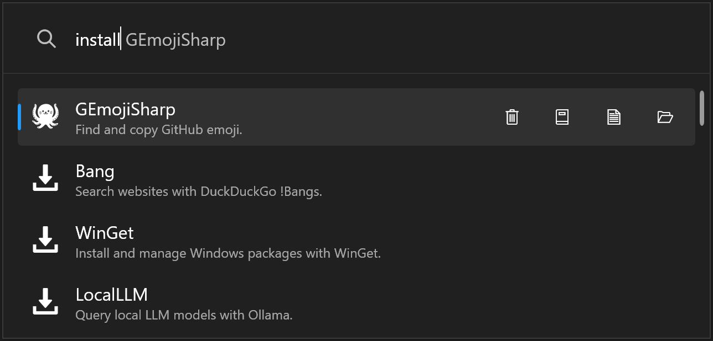
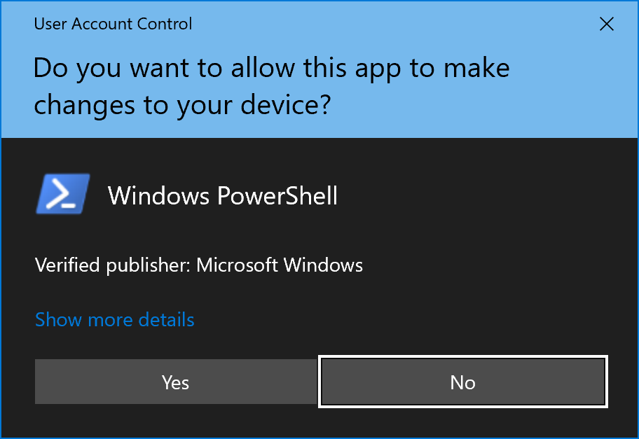
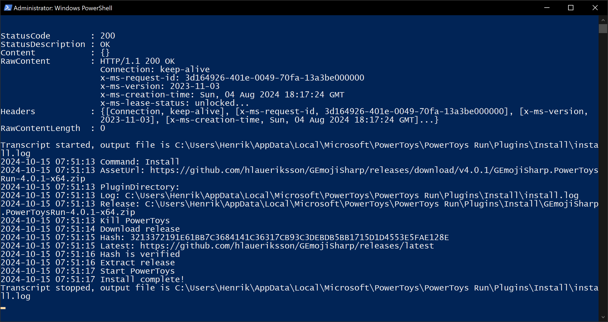
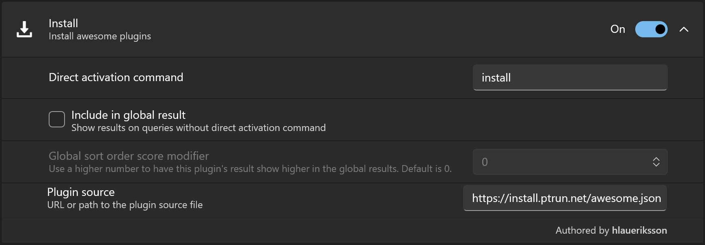

# Community.PowerToys.Run.Plugin.Install

[](https://github.com/hlaueriksson/Community.PowerToys.Run.Plugin.Install/actions/workflows/build.yml)

> Install awesome community PowerToys Run plugins via this plugin ⬇️🔌📦

Action keyword:

- `install`

Plugin source:

- <https://github.com/hlaueriksson/awesome-powertoys-run-plugins>

## Installation

This plugin has been developed and tested with PowerToys `v0.87.1`.

Prerequisites:

1. [Install PowerToys](https://docs.microsoft.com/en-us/windows/powertoys/install)
2. Make sure [Windows PowerShell](https://learn.microsoft.com/en-us/powershell/scripting/learn/ps101/01-getting-started?view=powershell-5.1#where-to-find-powershell) is installed

Then:

1. Download the `.zip` file from the latest [release](https://github.com/hlaueriksson/Community.PowerToys.Run.Plugin.Install/releases/latest) and extract it to:
   - `%LocalAppData%\Microsoft\PowerToys\PowerToys Run\Plugins`
2. Restart PowerToys

## Usage

1. Open PowerToys Run with `alt + space`
2. Type `install`
   - A list of plugins will be displayed
3. Continue to type to find plugins
4. Use ⬆️ and ⬇️ keys to select a plugin
5. Press `Enter` to open the plugin website in the default browser
6. Press `Ctrl + Enter` to install the plugin
7. Press `Ctrl + N` to open the release notes in the default browser

Installed plugins:

1. Press `Ctrl + Enter` to update the plugin (if update available)
2. Press `Ctrl + Del` to uninstall the plugin
3. Press `Ctrl + F` to open the plugin folder in File Explorer



The user can:

- Install plugin
- Update plugin
- Uninstall plugin
- Open repo
- Open release notes
- Open plugin folder

Outdated packages:

```
install outdated
```

- Display and update outdated packages

Reload plugin source:

```
install reload
```

- Reloads the plugin source file from the URL or path provided in the settings

The plugins are installed/updated/uninstalled via a [PowerShell script](src/Community.PowerToys.Run.Plugin.Install/install.ps1).



- The install/update/uninstall requires the script to run as administrator



- The output of the script

## Settings

1. Open PowerToys Settings
2. Click PowerToys Run in the menu to the left
3. Scroll down to the Plugins section
4. Expand the Install plugin



Default plugin source:

- `https://install.ptrun.net/awesome.json`

## Plugins

During install/update of plugins, the release assets (`.zip` files) are downloaded to the plugin folder.

The `.zip` files are not deleted and will remain in the folder:

- `%LocalAppData%\Microsoft\PowerToys\PowerToys Run\Plugins\Install\`

## Log

During install/update/uninstall of plugins, an `install.log` file is written to the plugin folder:

```txt
**********************
Windows PowerShell transcript start
Start time: 20241015075857
Username: DESKTOP-SHOAM2C\Henrik
RunAs User: DESKTOP-SHOAM2C\Henrik
Configuration Name: 
Machine: DESKTOP-SHOAM2C (Microsoft Windows NT 10.0.19045.0)
Host Application: C:\Windows\System32\WindowsPowerShell\v1.0\powershell.exe -ExecutionPolicy Bypass -File C:\Users\Henrik\AppData\Local\Microsoft\PowerToys\PowerToys Run\Plugins\Install\install.ps1 -command Uninstall -pluginDirectory C:\Users\Henrik\AppData\Local\Microsoft\PowerToys\PowerToys Run\Plugins\Bang
Process ID: 7456
PSVersion: 5.1.19041.5007
PSEdition: Desktop
PSCompatibleVersions: 1.0, 2.0, 3.0, 4.0, 5.0, 5.1.19041.5007
BuildVersion: 10.0.19041.5007
CLRVersion: 4.0.30319.42000
WSManStackVersion: 3.0
PSRemotingProtocolVersion: 2.3
SerializationVersion: 1.1.0.1
**********************
Transcript started, output file is C:\Users\Henrik\AppData\Local\Microsoft\PowerToys\PowerToys Run\Plugins\Install\install.log
2024-10-15 07:58:57 Command: Uninstall
2024-10-15 07:58:57 AssetUrl:
2024-10-15 07:58:57 PluginDirectory: C:\Users\Henrik\AppData\Local\Microsoft\PowerToys\PowerToys Run\Plugins\Bang
2024-10-15 07:58:57 Log: C:\Users\Henrik\AppData\Local\Microsoft\PowerToys\PowerToys Run\Plugins\Install\install.log
2024-10-15 07:58:57 Kill PowerToys
2024-10-15 07:58:58 Delete plugin folder
2024-10-15 07:58:58 Start PowerToys
2024-10-15 07:58:58 Uninstall complete!
**********************
Windows PowerShell transcript end
End time: 20241015075858
**********************
```

The `install.log` file is overwritten the next time you install/update/uninstall a plugin.
